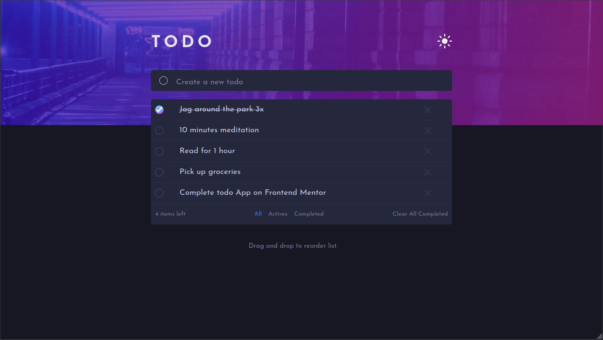
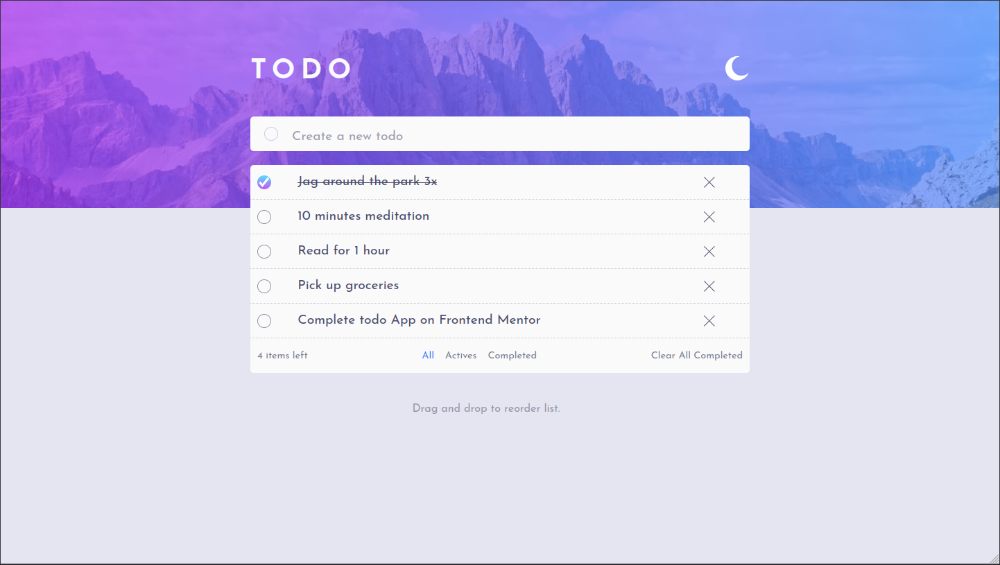

# Frontend Mentor - Todo app solution

This is a solution to the [Todo app challenge on Frontend Mentor](https://www.frontendmentor.io/challenges/todo-app-Su1_KokOW).

### The challenge

Users should be able to:

- View the optimal layout for the app depending on their device's screen size
- See hover states for all interactive elements on the page
- Add new todos to the list
- Mark todos as complete
- Delete todos from the list
- Filter by all/active/complete todos
- Clear all completed todos
- Toggle light and dark mode

### Screenshot

### Links

- Solution URL: [Frontend Mentor](https://www.frontendmentor.io/solutions/--responsive-layout-flexcss-darkmodevuetify-componentsvue-8F-Y693rOP)
- Live Site URL: [Vercel Link](https://todo-app-frontend-mentor-rho.vercel.app/)

### Built with

- Semantic HTML5 markup
- CSS custom properties
- Flexbox
- Mobile-first workflow
- [Vue](https://vuejs.org/) - JS library
- [Vuetify](https://nextjs.org/) - Component framework 

## Author

- Frontend Mentor - [@CarolineT9](https://www.frontendmentor.io/profile/yourusername)
- Linkedin - [@Caroline Tavares](https://www.linkedin.com/in/caroline-tavares-65150b189/)

